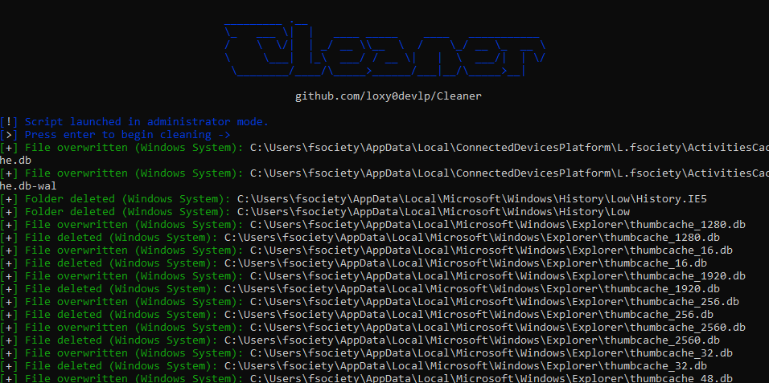

<h1 align="center">
  Cleaner
</h1>

  This tool is a Python script that removes all traces from software, browsers, and the system (files, caches, histories, logs, and registry) with secure data overwriting to prevent forensic analysis.

<h2>🚀 Features:</h2>

<ul>
  <li>💻 Available on Windows and Kali Linux.</li>
  <li>🧹 Removes system traces, application data, and user activity remnants.</li>
  <li>🌐 Cleans browser data (e.g. Firefox profiles, caches, cookies).</li>
  <li>📁 Deletes software-related files, logs, and temporary data.</li>
  <li>🧠 Cleans system artifacts (cache, history, crash logs, temporary files).</li>
  <li>🧾 Removes Windows registry traces (on Windows).</li>
  <li>🗑️ Empties system recycle bin / trash across all disks.</li>
  <li>🔐 Secure overwriting before deletion to reduce data recovery.</li>
  <li>⚙️ JSON-based configuration for precise cleaning paths.</li>
</ul>

<h2>⚙️ Installation:</h2>

<ol>
  <li>Clone the repository:</li>
  <pre>git clone https://github.com/loxy0devlp/Cleaner.git</pre>

  <li>Enter the project folder:</li>
  <pre>cd Cleaner</pre>

  <li>Install Python dependencies:</li>
  <pre>pip install -r requirements.txt</pre>

  <li>Run the script:</li>
  <pre>python cleaner.py</pre>
</ol>

<h2>📋 Usage:</h2>

<ul>
  <li>If you are on Windows, set the path to your TOR browser if installed.</li>
  <li>Run the script with administrator/root privileges.</li>
  <li>Confirm execution when prompted.</li>
  <li>The tool will automatically scan and remove predefined traces.</li>
  <li>Wait for the cleaning process to finish.</li>
</ul>

<h2>⚠️ Important:</h2>

<ul>
  <li>Administrator/root privileges are required.</li>
  <li>Deletion is permanent, and deleted files cannot be recovered.</li>
  <li>Incorrect configuration may result in data loss.</li>
  <li>Advanced users only.</li>
</ul>

<h2>📊 Supported Software / Components:</h2>

<table border="1" cellpadding="6" cellspacing="0">
  <tr><th>Software / Components</th><th>Windows</th><th>Linux</th></tr>

  <tr><td>System traces (cache, logs, temp, history)</td><td>✔</td><td>✔</td></tr>
  <tr><td>Trash / Recycle Bin</td><td>✔</td><td>✔</td></tr>
  <tr><td>Firefox Browser</td><td>✔</td><td>✔</td></tr>
  <tr><td>Tor Browser</td><td>✔</td><td>✔</td></tr>
  <tr><td>Visual Studio Code</td><td>✔</td><td>✔</td></tr>
  <tr><td>Telegram</td><td>✔</td><td>✔</td></tr>
  <tr><td>Session</td><td>✔</td><td>✔</td></tr>
  <tr><td>Mullvad VPN</td><td>✔</td><td>✔</td></tr>
  <tr><td>CCleaner</td><td>✔</td><td>✖</td></tr>
  <tr><td>WinRAR</td><td>✔</td><td>✖</td></tr>
  <tr><td>Modern CSV</td><td>✔</td><td>✖</td></tr>
  <tr><td>EmEditor</td><td>✔</td><td>✖</td></tr>
  <tr><td>LibreOffice</td><td>✔</td><td>✔</td></tr>
  <tr><td>Sqlmap</td><td>✖</td><td>✔</td></tr>
  <tr><td>John (John the Ripper)</td><td>✖</td><td>✔</td></tr>
  <tr><td>MySQL</td><td>✔</td><td>✖</td></tr>
</table>

<h2>📸 Preview:</h2>

<h2>👨‍💻 Credits:</h2>

<ul>
  <li>Developed by: <b>loxy0devlp</b></li>
  <li>GitHub: <a href="https://github.com/loxy0devlp">github.com/loxy0devlp</a></li>
  <li>GunsLol: <a href="https://guns.lol/loxy0dev">guns.lol/loxy0dev</a></li>
  <li>License: <b>MIT License</b></li>
  <li>Version: <b>v1.0</b></li>
</ul>
